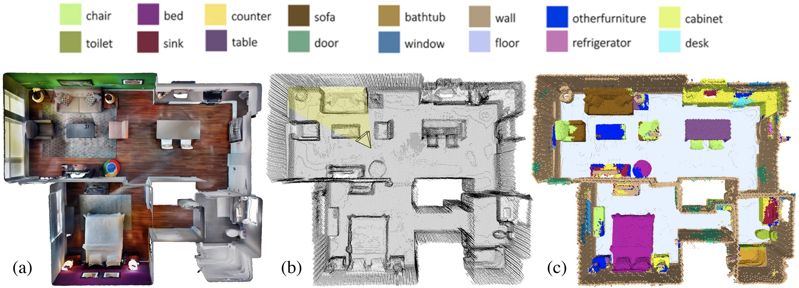
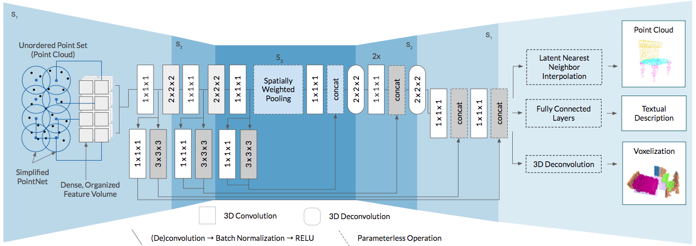

Fully-Convolutional Point Networks for Large-Scale Point Clouds
====

End-to-end deep learning on large-scale real-world 3D data for semantic segmentation and scene captioning.

[Paper](https://arxiv.org/abs/1808.06840) by Dario Rethage, Johanna Wald, Jürgen Sturm, Nassir Navab and Federico Tombari.

## Example



a) Textured mesh (not used) b) Input point cloud c) Semantic voxel segmentation

## Features

* Hybrid (point-to-voxel) network architecture capable of processing arbitrarily large point clouds in a single pass
* Operates on memory efficient input data representations (meshes/point clouds) while avoiding the redundant propagation of spatial information around points through the network (a limitation of point-based methods)
* Operates on raw sensor data, no pre-processing/encoding necessary
* Produces either an ordered output (voxelization) or maps predictions directly onto the input cloud, thus making it suitable as a general-purpose point cloud descriptor applicable to many 3D tasks
* Evaluated on semantic voxel segmentation, semantic part segmentation and 3D scene captioning tasks

## Architecture



## Setup

It is recommended to use a [virtual environment](http://virtualenvwrapper.readthedocs.io/en/latest/install.html)

1. `git clone https://github.com/drethage/fully-convolutional-point-network.git`
2. `./setup.sh` (installs python depdencies and compiles CUDA ops)

The project has been tested with Tensorflow 1.12, CUDA 9.0, CUDNN 7.4.1 on Ubuntu 16.04 LTS.

## Usage

There are three operating modes: training, evaluation and prediction. A JSON-formatted configuration file defines the parameters of an existing or a new session. The structure of this configuration file is described [here](config/config.md). Note: this project was originally developed using [ScanNet](http://www.scan-net.org), but is not ScanNet specific. Minimal effort should be required to traing and evaluate this method on new datasets.

### Training

Training sessions are differentiated from one another by a session ID defined in `config.json`. All artifacts generated during training are placed in a folder corresponding to this session ID in the `sessions/` folder.

To start training: `python main.py --mode train --config <path_to_config_file>`. Training will begin after the dataset is prepared for training (a cache will be saved to disk).

### Evaluation

To evaluate a model we present every item in the validation set to the most recent checkpoint present in a session folder, and calculate the intersection-over-union (IoU) over all learnable classes.

To begin evaluation: `python main.py --mode evaluate --config <path_to_config_file>`. Note: --config should contain the path to a configuration file *in a session folder*. Optionally, specify which device to use by setting the `--device` flag to *cpu* or *gpu*.

### Prediction

After training and evaluating a model, we may wish to predict on unseen data.

To predict on a new mesh or point cloud: `python main.py --mode predict --file <path_to_PLY_file>`. Optionally, specify which device to use by setting the `--device` flag to *cpu* or *gpu*. Optionally, use a custom set of colors to represent distinct classes by giving the path to a colors.txt file via `--colors`.

## Citation

If you find our work useful, please consider citing:
```
  @inproceedings{rethage2018eccv,
  author  =  {Rethage, D., Wald, J. Sturm, J. Navab, N., Tombari, F.},
  title   =  {Fully-Convolutional Point Networks for Large-Scale Point Clouds},
  booktitle =  {European Conference on Computer Vision (ECCV)},
  year    =  {2018}
}
```

## Updates

* February 2019: Code published for Semantic Voxel Segmentation
* September 2018: Paper published

## License

[MIT](LICENSE)